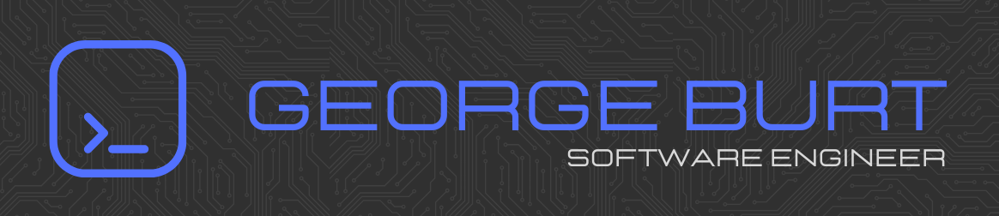

I’m a Software Engineer focused on designing and building bespoke, scalable systems with a strong emphasis on performance, maintainability, and clean architecture. I take a holistic approach to development, balancing technical excellence with practical delivery across the full software lifecycle.

With a keen focus on collaboration and continuous improvement, I strive to integrate modern development practices, including testing, automation, and DevOps, to deliver robust solutions that meet both user needs and business goals.

## Skills

### Languages

### Frontend

### Backend

### Testing

### Data Management

### DevOps

### Version Control

## Get in touch

