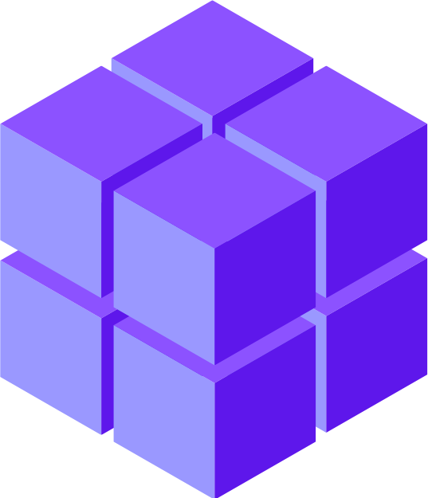
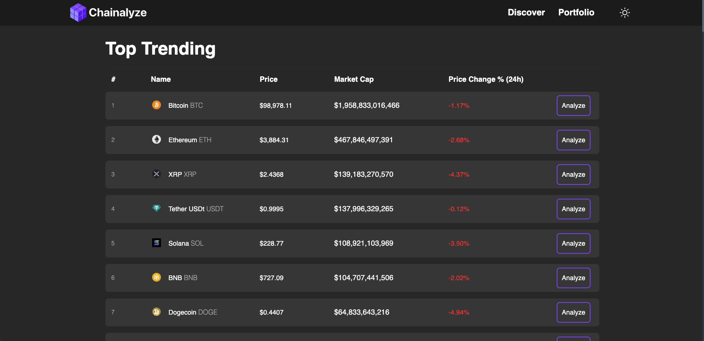

# Hi, I'm George! 

I'm a **Software Engineer** passionate about designing and building scalable, efficient applications. I thrive on solving complex problems and delivering meaningful solutions.

Before transitioning into development, I played a key role in managing my father's business, where I honed my problem-solving, communication, and leadership skills. These experiences now shape how I approach creating innovative and practical applications.

## Tech Stack

## Current Major Projects
###  [Chainalyze](https://github.com/georgeeburt/chainalyze)

    

A comprehensive cryptocurrency analysis aggregation platform featuring real-time price tracking via WebSockets, portfolio management, and interactive visualizations using React, TypeScript, Express, and MongoDB.
Chainalyze helps users:

- **Track Markets in Real-Time:** Live price updates, volume data, and market cap tracking powered by the Binance WebSocket API
- **Manage Portfolios:** Build and monitor cryptocurrency portfolios with real-time valuation and performance metrics
- **Visualize Data:** Interactive charts and graphs showing price movements, portfolio distribution, and market trends
- **Analyze Tokens:** Deep dive into individual cryptocurrencies with comprehensive metrics, historical data, and resource links
- **Monitor Performance:** Track investment performance across multiple timeframes with clear visual indicators and percentage changes

Built with a modern tech stack emphasizing real-time data, responsive design, and intuitive user experience.
